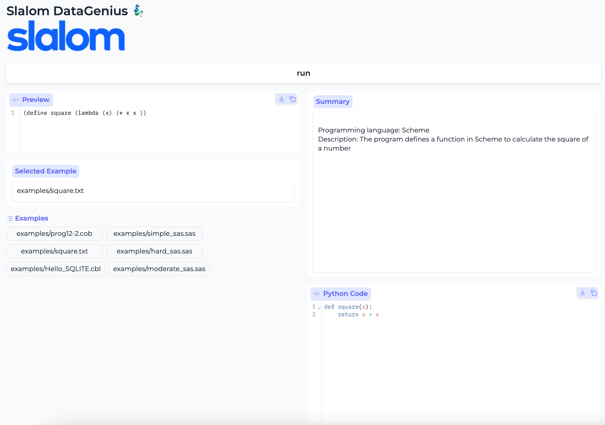

<!--
theme: custom
class: invert
size: 4:3
-->

<!-- -->

## AWyeS Labs - Building GenAI demos with AWS Bedrock and Gradio

---

# Why?

"I had some doubts going into this, but looks like GenAI is the real deal"
-- Build Chicago Engineer

---

# Goal

- Create a quick demo that interact with AWS Bedrock using Python and Gradio

---

# Ground rules

  - There is no rules, please explore at wish
  - It is OK to play with prompt and do your own experimentation

---

## What's GenAI

Generative artificial intelligence is artificial intelligence capable of generating text, images, or other media, using generative models.

The current form of GenAI is based in Deep Learning which is based on Neural Networks which were invented in 1958. But they are based in techniques from 1800's.

---

## What's AWS Bedrock?

Amazon Bedrock is a fully managed service that makes large language models (LLMs) from leading AI companies available through a single application programming interface (API)

---

## What's Gradio?

Gradio is an open-source Python package that allows you to develop demos for machine learning applications

---

## What will we be doing?

#### Data genius demo
- Summary of a legacy code
- Convert code to python
- Confidence of the conversion (time permitting)

---

## Requirements

- Access to InnovationLabs (aws.slalom.com)
- `aws-azure-login` installed and configured
- Download repo

---

## For `aws-azure-login` follow this guide

https://slalom.service-now.com/help?id=kb_article&table=kb_knowledge&sysparm_article=KB0015023

---

## Download Repo:
https://github.com/pmelendez-slalom/aws-bedrock-lab

---

## AWS Bedrock Playground

---

## Time to play!
